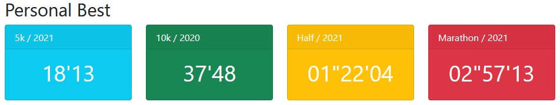
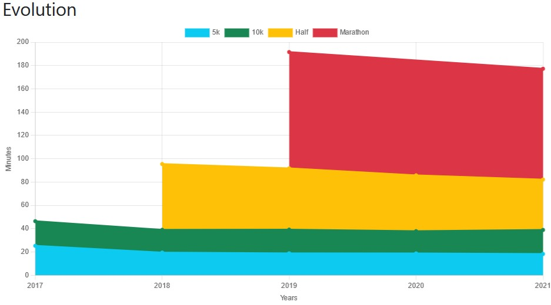
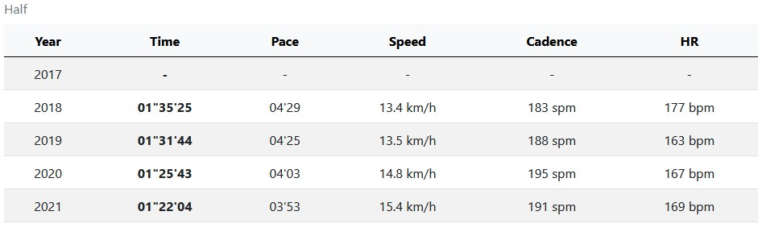

PHP Garmin Connect
==================

A fork of [php-garmin-connect](https://github.com/10REM/php-garmin-connect) that allows to display your personal records year by year on running races.

It's a quick & dirty but functional work! [See the online demo](http://run.bientz.com)

## Getting started

Create a `.env` file with the followings:

```
GARMIN_SINCE=2017
GARMIN_USERNAME=your@email.tld
GARMIN_PASSWORD=your-password
```

* `GARMIN_SINCE` describes the first year from which you want to request data (e.g from 2017 to current year).
* `GARMIN_USERNAME` & `GARMIN_PASSWORD` are just your Garmin credentials (Garmin Connect).

Run `composer install` to install dependencies and open `index.php` on a browser.

The first display could take a moment, especially if you want to grab many years/distances. 

Then, data are cached in `data/records.json` to avoid unnecessary Garmin's crawls (use query string `?refresh` param to flush cache, see [Tweak](#tweak) section). 

## How it works?

It'll make a request on Garmin Connect for each year and distance (+/-2%) you want to collect and take the best time effort, that's it!

We also collect some other useful data including:
* `id`: the id of your activity (https://connect.garmin.com/modern/activity/{id})
* `date`: the start date of the race (yyyy-mm-dd hh:mm:ss)
* `distance`: the exact distance traveled (in meters)
* `time`: the formatted duration (hh"mm'ss or mm'ss if shorter than an hour)
* `pace`: the formatted average pace (mm'ss per 1 kilometer)
* `speed`: the average speed (km/h)
* `cals`: calories burned
* `hr`: the average heart rate (bpm)
* `cadence`: the feet pace (per minute)

```js
{
	"42200": {
		"2021": {
			"duration": 10633.774002075195,
			"data": {
				"id": 6702582078,
				"date": "2021-05-01 09:00:00",
				"distance": 42410,
				"time": "02\"57'13",
				"pace": "04'10",
				"speed": 14.4,
				"cals": 2668,
				"hr": 167,
				"cadence": 189
			}
		}
	}
}

```

## Data

The page displays:
 
### All time PB

Personal best of all time.

<p align="center">
    
</p>
 
### Line chart 

A chart with your personal records grouped by year on all the classic distances (5k, 10k, half & marathons).

<p align="center">
    
</p>

### History

It also displays a summary with more data for all events.

<p align="center">
    
</p>

## Tweak

If you want to remove/add some distances, feel free to edit [these lines](https://github.com/laurent-bientz/php-garmin-connect/blob/master/index.php#L21-L57):
* `label` is the human label used to describe the race distance
* `color.alias` is the [Boostrap color class](https://getbootstrap.com/docs/5.1/customize/color/#theme-colors) used on cards "Personal Best" section.
* `color.hex` is the hexadecimal value used on the chart (could be the same than `Bootstrap` but not necessary).

If you want to refresh data:
* `?refresh` to force refresh current year
* `?refresh=all` to force refresh all years

## Credits

All credits to [David Wilcock](https://github.com/dawguk) for his great library, I only adapted this one to allow searching on specific filters (not possible on the base solution) and collected/aggregated data.